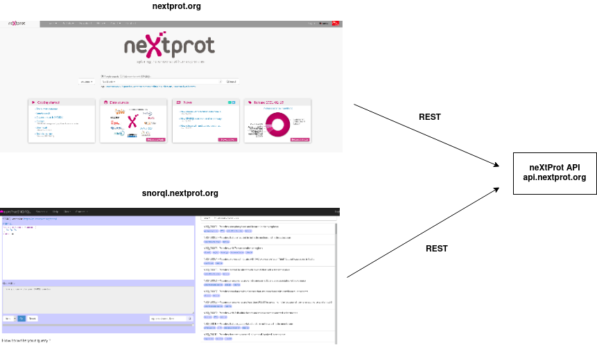

#GSOC 2021 

## Development of a user interface for the Ensembl Variant Effect Predictor neXtProt plugin as one of the  community tools hosted on the neXtProt portal

### neXtProt

[neXtProt](www.nextprot.org) is an open source discovery platform for human genes and proteins developed at the Swiss Institute of Bioinformatics (ELIXIR-CH). The neXtProt team would like to develop a web based user interface for the VEP neXtProt plugin and include it as one of the  community tools hosted on the neXtProt portal, in order to improve its accessibility.

### neXtProt system overview
neXtProt is a public portal accessible at www.nextprot.org. neXtProt exposes different ways for the users to view and use data. 
High level overview of neXtProt components can be found here. .

* Web User Interface (nextprot.org)
Web User Interface is developed in Angular and Polymer as the main technologies. It also integrates several other web components to add more features.

* SPARQL web interface (snorql.nextprot.org)
SPARQL is a semantic query language, which can be used to query a semantic knowledge base. neXtProt exposes its as a semantic model for SPARQL users and exposes a simple web interface for the users play with SPARQL queries over neXtProt data.

* API (api.nextprot.org)
neXtProt exposes a public API for the users to use neXtProt data in a more advanced and programmatic way. Both the main UI and SPARQL UI utilize the API to fetch the required data.

### Project Description

#### User Interface for Variant Effect Predictor neXtProt plugin

In order to be able to interpret human genomic variation data, several open source tools such as the [Ensembl Variant Effect Predictor (VEP)](https://www.ensembl.org/info/docs/tools/vep/index.html) 
have been developed to predict the structural and functional effects of variants (SNPs, insertions, deletions, CNVs or structural variants) on genes, transcripts, and protein sequences, as well as regulatory regions. 

The VEP tool takes input variants in different formats such as VCF, HGVS and variant identifier formats such as SNPs, and produces the output with the predicted effect on the selected biological entities. 
The VEP tool has numerous [plugins](https://m.ensembl.org/info/docs/tools/vep/script/vep_plugins.html) including a neXtProt plugin, which was made public last november as a command line. This plugin improves the accuracy of predictions  about coding single nucleotide polymorphisms by integrating manually curated information from neXtProt about domains, PTMs, interacting regions etc. associated with the affected amino-acid positions. 
The proposed user interface visualizes the predicted variant effect output for all variants within a neXtProt entry. It has to handle the possibly large number of variants in the neXtProt entry and handle the corresponding large VEP output in an optimal manner. 

#### Objective

Objective of the project is to develop a user interface to visualize the variant prediction data from the VEP tool in the neXtProt context. neXtprot has its own UI components to visualize neXtProt annotations (features on proteins) on the protein's amino acid sequence. [Feature viewer](https://github.com/calipho-sib/feature-viewer) is such a visualization UI component developed and integrated in [neXtProt UI](https://www.nextprot.org/entry/NX_P52701/sequence).
In this project, feature viewer and other relevant neXtProt UI components (will be elaborated in the student proposal) will be used to visualize the variant prediction output from VEP. Therefore neXtProt users will be able to 

##### Development steps

* Familiarize with neXtProt API, UI and snorql, explore the type of data neXtProt exposes.
* Study the feature viewer. [Source](https://github.com/calipho-sib/feature-viewer), [Publication](https://www.nextprot.org/news/new-publication-the-feature-viewer-a-visualization-tool-for-positional-annotations-on-a-sequence) 
* Understand the required API endpoints to be used in the UI.
* Design (An initial [mockup]() will be given from neXtProt) the UI with the different UI components.
* Implemention and Testing

#### Preparation

Students can start exploring the neXtProt tools by referring to www.nextprot.org and the resources mentioned below. A warm-up exercise would be to write a simple javascript (any related platform) program to call the nextprot API and list/visualize the data returned. 

### References

* Overview of the [neXtProt Concept](https://www.nextprot.org/about/nextprot)
* [Technical Corner](https://www.nextprot.org/help/technical-corner)
* [neXtProt github](https://github.com/calipho-sib)
* neXtProt features visualization [Feature viewer](https://github.com/calipho-sib/feature-viewer)

### Contact
kasun Samarasinghe [kasun.wijesiriwardana@unige.ch](mailto:kasun.wijesiriwardana@unige.ch)

### Results
This project was sucessfully completed by [Shrey Sachdeva](https://medium.com/@shreysachdeva.2000) and an insightful resume of the work can be found [here](https://medium.com/@shreysachdeva.2000/obf-development-of-a-user-interface-for-the-vep-nextprot-plugin-cebafa386d64).
