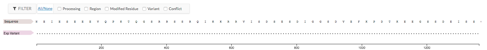
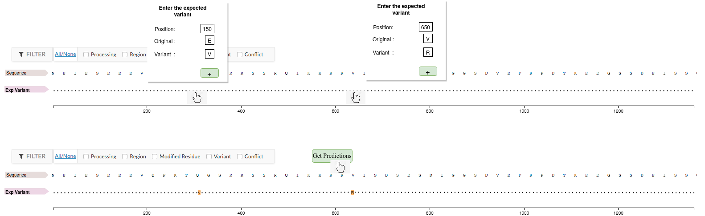
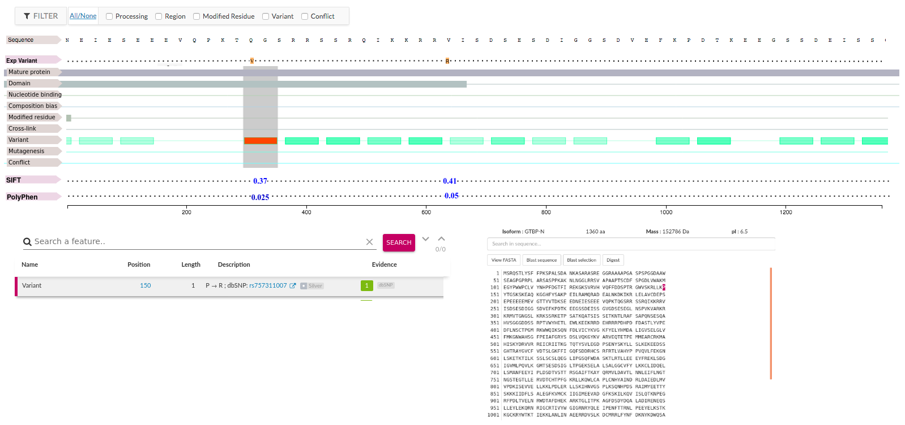

### Tentative mockup

A tentative mockup to start the design and development.

#### Landing page

Landing page loads the feature viewer and loads the corresponding protein sequence .

#### User Interaction to enter variants

On the feature viewer, users can enter one or more possible variants, where they want to get the variant effects along with the nextprot annotations 

#### Results display with feature table and sequence view

Once the user enters the variants, variant effects (SIFT and PolyPhen) will be retrieved from ensembl vep plugin and displayed on the feature viewer. Also users can select the relevant annotations on the feature viewer. When the user selects the chosen variant features are shown on the triple viewer and sequence viewer. 
  